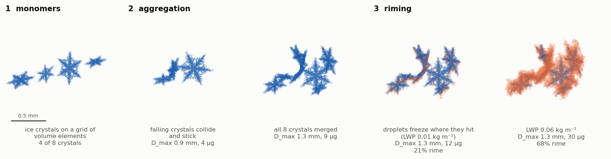

<p align="center">
  <picture>
    <source media="(prefers-color-scheme: dark)" srcset="snowagg/docs/img/logo-dark.svg">
    
  </picture>
</p>

**snowagg** builds 3D models of snowflakes: ice crystals, aggregates of crystals, and rimed and
deposition-grown snowflakes, as clouds of small volume elements. It is a C++ implementation of
**[`aggregation`](https://github.com/jleinonen/aggregation)**, the snowflake model of Jussi Leinonen
(in the version of the [OPTIMICe-team fork](https://github.com/OPTIMICe-team/aggregation)):

* **Same model, same Python API.** Replace `from aggregation import ...` by `from snowagg import ...`.
* **About 20–90 times faster** for complete runs: a run that takes 8 minutes in the original takes
  7–19 s.
* **Verified against the original.** In a verification configuration, complete runs agree bit
  for bit; in normal use, the snowflakes are statistically the same.
* **Easy to install:** one `pip install`; you only need a C++ compiler, CMake and Eigen.



> [!WARNING]
> **snowagg is completely vibe coded:** the C++ code, the Python wrappers, the tests and the
> documentation were written by an AI coding assistant (Anthropic's Claude). It is only as
> trustworthy as its [verification against the original](snowagg/README.md#how-it-was-verified).
> Check the results for your use case before you rely on them.

## Install

On Debian/Ubuntu (other systems: install a C++17 compiler, CMake ≥ 3.15 and Eigen 3):

```bash
sudo apt install build-essential cmake libeigen3-dev
pip install "git+https://github.com/snilsn/aggregation.git#subdirectory=snowagg"
```

pip downloads the code, compiles the C++ core (about a minute) and installs the package with
numpy and scipy. To work on the code or run the tests, clone the repository instead:

```bash
git clone https://github.com/snilsn/aggregation.git
pip install ./aggregation/snowagg
```

Build options and development builds: [snowagg/README.md](snowagg/README.md#build-options-and-development-builds).

## Quick start

```python
from snowagg import riming, mcs, fallvelocity

# monomers: dendrites from an exponential size distribution, 10 µm volume elements
gen = riming.gen_monomer(psd="exponential", size=1e-3, min_size=0.1e-3, max_size=3e-3,
                         mono_type="dendrite", grid_res=10e-6, rimed=True)

# aggregate 10 of them, then rime the aggregate with 0.1 kg/m² of liquid water
agg = riming.generate_rimed_aggregate(gen, N=10, riming_lwp=0.1, riming_mode="subsequent",
                                      lwp_div=10, seed=1)

X = agg.X                                                     # (n, 3) element coordinates [m]
mass = riming.rho_i * len(agg) * agg.grid_res**3              # kg
D_max = 2 * mcs.minimum_covering_sphere(X)[1]                 # m
v = fallvelocity.fall_velocity(agg, T=263.15, P=1000e2)       # m/s
```

Monomer types: `plate`, `column`, `needle`, `dendrite`, `rosette`, `bullet`, `spheroid`, and
mixtures of them. Code written for `aggregation` runs unchanged with `from snowagg import ...`;
the modules `aggregate, crystal, dendrite, deposition, fallvelocity, generator, mcs, riming,
riming_runs, rotator, stl` have the same names and functions.

## How it works

**The model** (Leinonen and Moisseev, 2015; Leinonen and Szyrmer, 2015) represents a snowflake by
the centres of small volume elements of ice (cubes with edge `grid_res`, for example 10 µm):

1. **Monomers.** A crystal shape (hexagonal plate, column, needle, rosette, bullet, spheroid, or a
   dendrite grown with Reiter's 2D model) is filled with the points of a Cartesian grid and
   randomly rotated.
2. **Aggregation.** Pairs of particles are chosen with a probability that mimics differential
   sedimentation: larger cross sections and larger differences in fall speed collide more often.
   One particle is dropped onto the other at a random horizontal position and sticks where they
   first touch (allowing a small penetration). The aggregate is then turned back into a falling
   orientation, and this repeats until all crystals form one snowflake.
3. **Riming.** Supercooled droplets fall onto the particle at random positions; their number
   follows from the liquid water path and the particle's projected area. Each droplet freezes
   where it hits. Riming happens after the aggregation, or after every merge.
4. **Deposition and sublimation** (optional): a random walk adds or removes elements at the surface.
5. **Properties**: mass, maximum dimension (minimum covering sphere), projected areas, aspect
   ratios, fall velocities (Heymsfield and Westbrook, 2010; Khvorostyanov and Curry, 2005), STL files.

**The implementation.** All geometry (lattices, collision search, riming, projections, spatial
indices, Reiter growth, deposition) is a header-only C++17 core, bound to Python with pybind11.
The Python driver of the original is kept, so the API is the same, and the C++ random number
generator reproduces numpy's, so `seed=` works as before. Operations on whole aggregates use
OpenMP; their results don't depend on the number of threads.

## Speed

Same workloads and seeds on an 8-core laptop (details in
[snowagg/README.md](snowagg/README.md#speed)):

| Workload | original | snowagg, 1 thread | snowagg, 8 threads |
|---|---|---|---|
| Aggregation of 20 dendrites, 10 µm elements | 5.3 s | 0.09 s (57×) | 0.06 s (94×) |
| Aggregation + riming, 10 dendrites, LWP 0.1 kg m⁻² | 46.7 s | 1.2 s (40×) | 1.0 s (46×) |
| 20 monomers, 0.55 M elements, with riming | 462 s | 18.5 s (25×) | 6.6 s (70×) |

## Verified against the original

The original Python package is part of this repository, and 86 tests compare snowagg with it
(`cd snowagg && python -m pytest tests`). Crystals, the random numbers and the aggregation and
riming kernels agree bit for bit, and so do complete runs in a verification configuration that
leaves the few linear-algebra steps to numpy. One complete run from both, element by element:


In normal use a few linear-algebra steps (principal axes, rotations) are computed in C++ instead
of by numpy's BLAS/LAPACK. Their results can differ in the last bits or in the sign of an
eigenvector, so the same seed then gives a different, but statistically equivalent snowflake.
The [full documentation](snowagg/README.md#same-geometry-as-the-original) explains this and shows the
ensemble comparisons.

## Documentation

[snowagg/README.md](snowagg/README.md) has the details:
[verification](snowagg/README.md#how-it-was-verified),
[why runs differ from the original](snowagg/README.md#why-the-normal-configuration-gives-different-snowflakes),
[speed](snowagg/README.md#speed),
[random numbers, threads and reproducibility](snowagg/README.md#random-numbers-threads-and-reproducibility),
[differences to the original](snowagg/README.md#differences-to-the-original) and the
[code layout](snowagg/README.md#layout).

## Credit and citation

All credit for the physics, the algorithms and the model design goes to the authors of the
original `aggregation` package: Jussi Leinonen, with contributions by Davide Ori, Markus Karrer and
others in the OPTIMICe-team fork. If you use snowagg, cite the original model:

* J. Leinonen and D. Moisseev (2015): What do triple-frequency radar signatures reveal about
  aggregate snowflakes? *J. Geophys. Res. Atmos.*, 120, 229–239,
  [doi:10.1002/2014JD022072](https://doi.org/10.1002/2014JD022072)
* J. Leinonen and W. Szyrmer (2015): Radar signatures of snowflake riming: A modeling study.
  *Earth and Space Science*, 2, 346–358, [doi:10.1002/2015EA000102](https://doi.org/10.1002/2015EA000102)
* for the monomer types and the aggregation kernel of the fork: M. Karrer et al. (2020): Ice
  particle properties inferred from aggregation modelling. *J. Adv. Model. Earth Syst.*, 12,
  [doi:10.1029/2020MS002066](https://doi.org/10.1029/2020MS002066)

## This repository

This repository is a fork of the original, with its full git history (up to the OPTIMICe-team
fork's commit `f05c607`):

* `aggregation/`, `notebooks/`, `setup.py`: the original Python package, unchanged except for one
  fix for SciPy ≥ 1.14 (`cumtrapz` → `cumulative_trapezoid` in `rotator.py`). Install it with
  `pip install .` from the repository root; the original's examples are in
  [notebooks/Rimed_aggregates.ipynb](notebooks/Rimed_aggregates.ipynb).
* `snowagg/`: the C++ implementation, its tests, benchmarks and documentation.

## License

MIT, as the original: [LICENSE.md](LICENSE.md) (original), [snowagg/LICENSE](snowagg/LICENSE) (snowagg).
