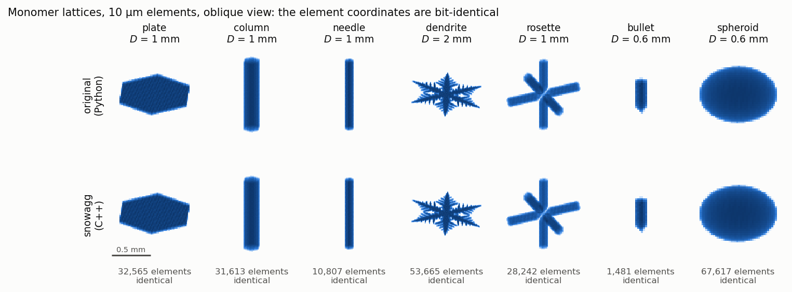
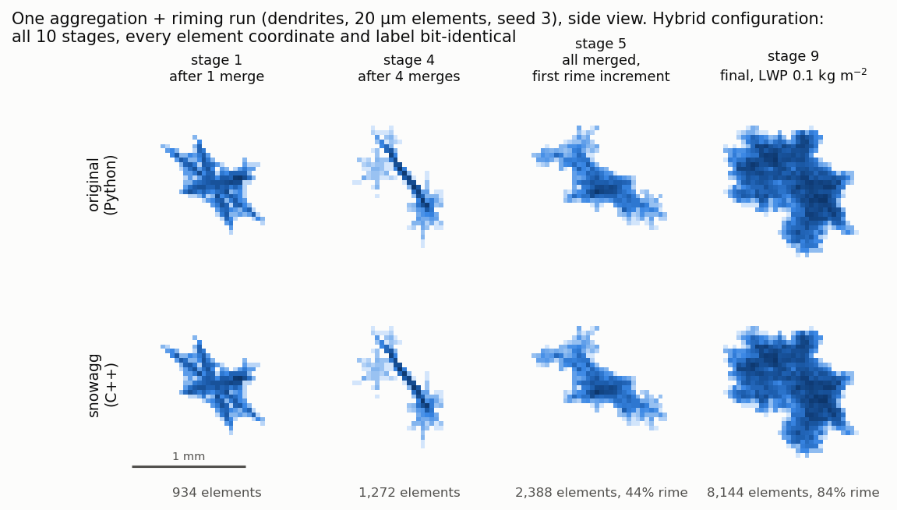
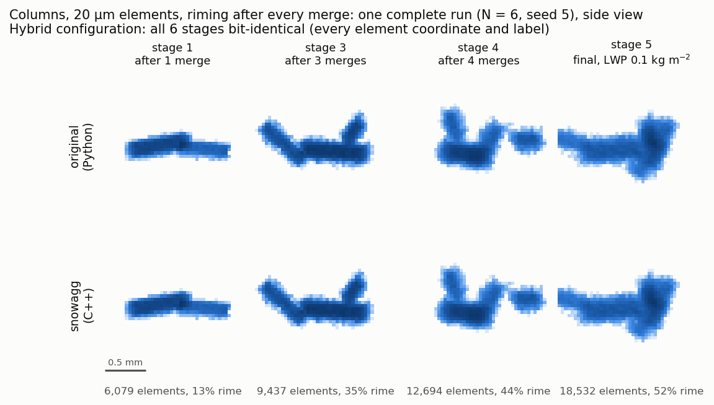
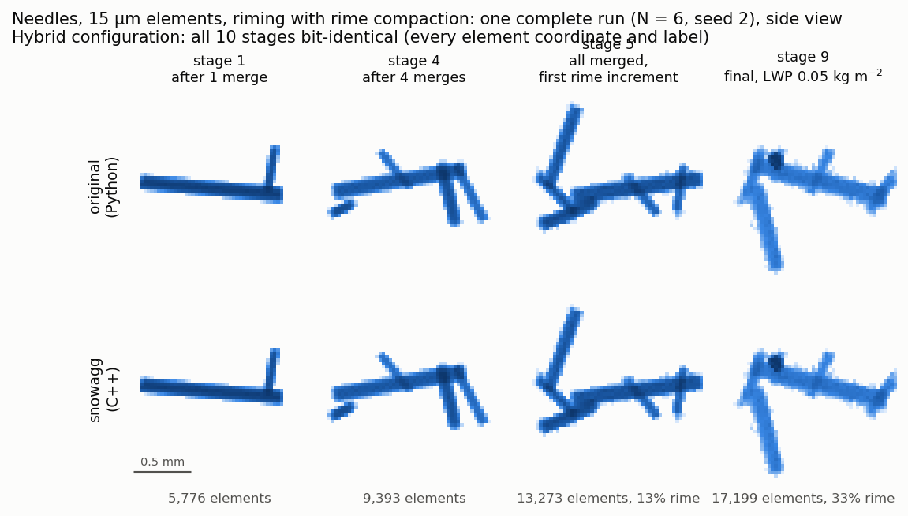
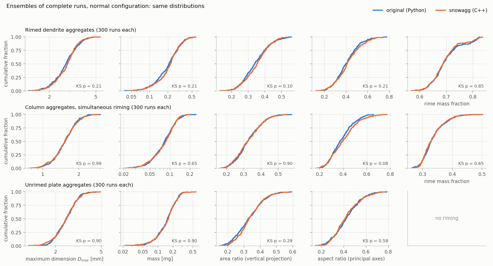
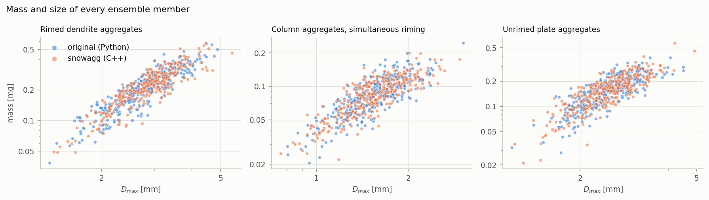
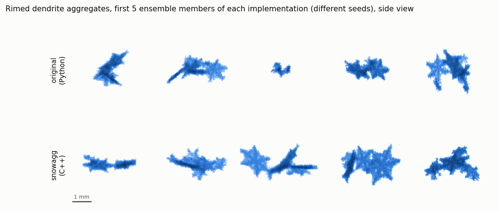
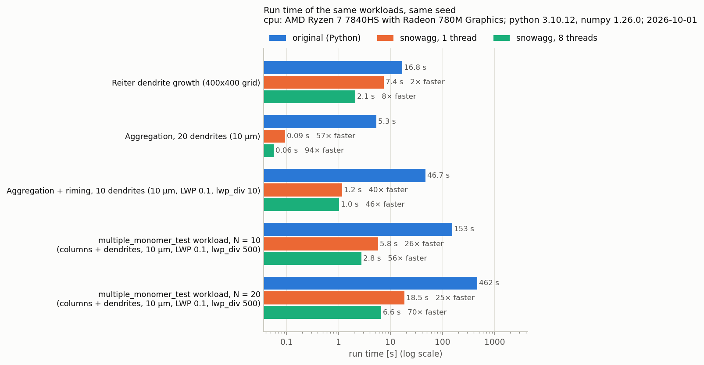
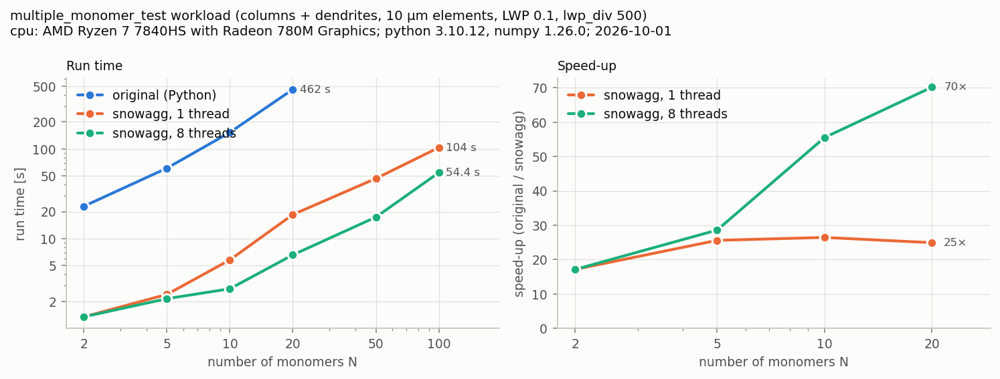

<p align="center">
  <picture>
    <source media="(prefers-color-scheme: dark)" srcset="docs/img/logo-dark.svg">
    
  </picture>
</p>

The full documentation of snowagg, a C++ implementation of the **`aggregation`** snowflake
model with the same Python API. For an overview, installation and a quick start, see the
[repository README](../README.md).

> [!WARNING]
> **This version is completely vibe coded.** The C++ code, the Python wrappers,
> the tests, the benchmarks, the figures and this README were generated by an AI
> coding assistant (Anthropic's Claude, via Claude Code). It is only as trustworthy
> as the verification described [below](#how-it-was-verified): every part is
> compared with the original Python implementation. Check the results for your use
> case before you rely on them.

## The original software

snowagg is a port of **[`aggregation`](https://github.com/jleinonen/aggregation)**
by Jussi Leinonen, in the version of the
**[OPTIMICe-team fork](https://github.com/OPTIMICe-team/aggregation)** (contributions by
Davide Ori, Markus Karrer and others). The port follows the fork at commit `f05c607`
(2025-08-18). This repository is built on the original's full git history; the original
package is at the repository root, in `aggregation/`, and the tests compare against it.
All credit for the model goes to its authors; please
[cite the original papers](../README.md#credit-and-citation).

## Build options and development builds

Requirements: a C++17 compiler, CMake ≥ 3.15, Eigen3, OpenMP (optional), and
Python with numpy and scipy. pip gets pybind11 and scikit-build-core for the build
itself. On Debian/Ubuntu, the system parts are `sudo apt install build-essential cmake
libeigen3-dev`.

From a clone of the repository (the original package is at its root, snowagg in the
folder `snowagg/`):

```bash
pip install ./snowagg                 # build and install into the active environment
cd snowagg && python -m pytest tests  # compare with the original (needs pytest)
```

For development, build in place and put `python/` on `PYTHONPATH` (from the
repository root):

```bash
cmake -S snowagg -B snowagg/build -Dpybind11_DIR=$(python -m pybind11 --cmakedir)
cmake --build snowagg/build -j
export PYTHONPATH=$PWD/snowagg/python
```

The build uses `-march=native` by default; to build for other machines (for example a
cluster with other CPUs), pass `-DSNOWAGG_NATIVE=OFF`, or with pip
`--config-settings=cmake.define.SNOWAGG_NATIVE=OFF`. Floating-point contraction (FMA) is
disabled on purpose; see below.

## Same geometry as the original

There are two ways to run snowagg, and both are compared with the original:

* **Hybrid configuration** (`tests/hybrid.py`, for verification only): snowagg's
  driver and all C++ kernels, with only the few steps that numpy hands to BLAS/LAPACK
  (rotations, alignment, principal axes) done by numpy. It reproduces the original
  **bit for bit**: every element coordinate of every stage of a complete run.
* **Normal configuration** (everything in C++, what you get when you use snowagg): these
  few steps are computed by snowagg itself, and their results can differ from numpy's in
  the sign of an eigenvector or in the last bits. From that point on a run continues
  differently, so the same seed gives a different snowflake. The snowflakes are
  **statistically the same**. Why this happens and why it can't simply be avoided is
  explained [below](#why-the-normal-configuration-gives-different-snowflakes).

Monomer lattices are bit-identical in both configurations:



Three complete aggregation and riming runs in the hybrid configuration, with
different monomers and riming modes; all stages are identical element by element:







Ensembles of complete runs in the normal configuration. The curves are the cumulative
distributions of size, mass, area ratio, aspect ratio and rime fraction; the
Kolmogorov–Smirnov p values test whether both come from the same distribution:





Some members of the rimed dendrite ensemble (different seeds, so different particles):



Regenerate these figures with `python docs/compare_geometry.py` (about 15 minutes on
6 cores; they use the original package at the repository root).

### Why the normal configuration gives different snowflakes

A few steps of the model are linear algebra on the whole aggregate. numpy does not
compute them itself but hands them to a BLAS/LAPACK library:

| Step | Original (numpy) | snowagg, normal configuration |
|---|---|---|
| Principal axes (used by `align` and `aspect_ratio`) | covariance `X.T.dot(X)` by BLAS, eigenvectors by LAPACK (`np.linalg.eigh`) | own C++ loop; the 3×3 eigenproblem by Eigen |
| `align`, `rotate`, orientation of new monomers | matrix products (`np.dot`) by BLAS | own C++ loops (OpenMP) |

Two things can come out differently:

1. **Eigenvector signs.** An eigenvector is only defined up to its sign: *v* and −*v*
   are equally correct answers. LAPACK and Eigen use different algorithms and often
   return opposite signs for one or more axes. `align` then puts the aggregate into
   the mirror image of the original's orientation, or turns it by 180°. The shape is
   the same, but its elements are in different places.
2. **Rounding in the last bits.** A sum of many numbers depends on the order in which
   they are added and on whether fused multiply-add instructions are used. BLAS
   libraries choose both per CPU, so coordinates can differ in the last bits (about
   10⁻¹² relative in the tests).

Either difference is enough to change the rest of the run. The model makes discrete
decisions based on the geometry: where the next monomer first touches the aggregate,
whether a rime particle hits an element, which grid cell of the spatial index an
element belongs to. Once one such decision comes out differently, the following random
numbers lead to different outcomes, and the run continues as a different snowflake.
This is how a stochastic model behaves, not an error: the snowflake is a different
random sample from the same distribution, as the ensemble figures above show.

**Why snowagg doesn't simply call BLAS/LAPACK as numpy does.** It would not make the
results equal to the original's, because the original is not reproducible to the last
bit itself:

* numpy uses whichever BLAS/LAPACK it was built with: usually a copy of OpenBLAS
  bundled with numpy, MKL in some conda installations, Accelerate on macOS.
* OpenBLAS picks a different compute kernel for each CPU type (Haswell, Skylake-X,
  Zen, …) and splits the work according to the number of threads. Each choice can
  change the last bits.
* So the original gives slightly different coordinates, and after a few steps
  different snowflakes, on different computers, with different numpy versions or
  with different thread settings.

To match it, snowagg would have to call exactly the library build that numpy uses on
that machine. numpy doesn't make its bundled BLAS available to other compiled code,
and such a match would break with every numpy update. The only robust way to get
numpy's exact numbers is to let numpy compute them, which is what the hybrid
configuration does, at the cost of copying the coordinates to numpy and back. Calling
BLAS would not make snowagg faster either: the operations are tiny (a 3×3 eigenproblem,
products of N×3 by 3×3 matrices) and limited by reading the coordinates from memory.

Instead, snowagg's own loops add up in a fixed order, so its results don't depend on
the number of threads or on which BLAS is installed. (Some machine dependence remains
through numpy functions the Python driver uses; see
[reproducibility](#random-numbers-threads-and-reproducibility).)

**What this means in practice**

* Compare snowagg with the original by ensembles, not by single seeds.
* With a given seed, snowagg gives the same snowflake every time on the same machine
  and installation.
* The hybrid configuration in `tests/hybrid.py` exists only to prove that all C++
  kernels and the driver are exact. It is a verification tool, not a supported mode.

## Speed

Measured with `docs/benchmark.py` on an AMD Ryzen 7 7840HS laptop (8 cores; snowagg
built with `-march=native`, the original with numpy 1.26 and its default settings).
Every workload runs with the same parameters and seed in both implementations.



| Workload | original | snowagg, 1 thread | snowagg, 8 threads |
|---|---|---|---|
| Reiter dendrite growth, 400×400 grid | 16.8 s | 7.4 s (2.3×) | 2.1 s (8×) |
| Aggregation of 20 dendrites, 10 µm elements | 5.3 s | 0.09 s (57×) | 0.06 s (94×) |
| Aggregation + riming, 10 dendrites, 10 µm, LWP 0.1, `lwp_div` 10 | 46.7 s | 1.2 s (40×) | 1.0 s (46×) |
| `multiple_monomer_test.py` workload, N = 10 (0.16 M elements) | 153 s | 5.8 s (26×) | 2.8 s (56×) |
| same, N = 20 (0.55 M elements) | 462 s | 18.5 s (25×) | 6.6 s (70×) |
| same, N = 100 (2.4 M elements) | – | 104 s | 54 s |



* The original's Reiter growth is already vectorized numpy, so the gain there is
  small; aggregation and riming, which loop in Python, gain the most.
* Riming costs about 2.3 µs per rime particle. With a large `lwp_div` most of the
  time goes into the 10 projected-area samples (each with align and rotate) per
  riming increment, which the model prescribes.
* Threads help most for large aggregates; the work is memory bound, so 8 threads
  give at most about 3× over 1 thread. For many runs, one single-threaded process per
  run is faster (`examples/parallel_ensemble.py`).

Regenerate with `python docs/benchmark.py` (about 30 minutes, mostly the original)
and `python docs/plot_benchmark.py`.

## Random numbers, threads and reproducibility

* The C++ generator reproduces numpy's legacy `RandomState` bit for bit. By
  default snowagg shares numpy's global random state, so `np.random.seed()`
  and the `seed=` argument work as in the original. `snowagg.set_rng_mode("own",
  seed)` switches to an independent generator.
* Whole-aggregate operations (rotate, align, projections, index building,
  lattice generation, Reiter dendrites) use OpenMP. The results do **not**
  depend on the number of threads; this is tested. By default snowagg uses
  half the logical CPUs (at most 8). Change this with `snowagg.set_num_threads(n)`
  or `OMP_NUM_THREADS`. Don't use all logical CPUs while other processes are
  busy: every parallel region then waits for a descheduled thread (a
  benchmark went from 1.8 s to 7 s). For parallel ensembles, run
  one process per member with `OMP_NUM_THREADS=1` (see
  `examples/parallel_ensemble.py`). Don't call snowagg from several Python
  threads at once: they would share one random generator.
* Results are reproducible on one machine. They can differ between machines in
  the last bits (numpy's SIMD math functions differ between CPUs), and then the
  runs diverge.

## How it was verified

`tests/` (pytest, 86 cases) compares every part with the original package at the
repository root:

```bash
cd snowagg && python -m pytest tests
```

| What | Result |
|---|---|
| RNG: `rand`, `randint`, Gaussian, `scipy.stats.expon`, state exchange | bit-identical |
| Crystal dimensions and generated lattices (all 7 types, size sweep, 46.7 µm) | bit-identical |
| Reiter dendrite growth, including the stopping criterion | bit-identical |
| `add_particle`, `add_elements`/recentering, `remove_elements`, projections, projected area/aspect ratio, `grid()`, STL files | bit-identical |
| `add_rime_particles` (with and without compaction), `compact_rime` | bit-identical¹ |
| Deposition/sublimation (`grow_ice`) | bit-identical given the same covering sphere and `arccos`² |
| **Complete aggregation + riming runs** (7 configurations, every yielded stage) | bit-identical³ |
| Principal axes, `align`, rotation matrices, minimum covering sphere | equal to ~1e-12 relative, up to eigenvector signs ([why](#why-the-normal-configuration-gives-different-snowflakes)) |
| Complete runs, all in C++ vs original: mass, rime mass, D_max, areas, aspect ratio | same distributions (KS tests; see the figures above) |

¹ The original's `argsort()` breaks ties among equal z values in an order that
depends on the CPU (AVX-512 or not). The tests use a stable sort in the
reference; snowagg always sorts stably.
² numpy's `arccos`/`exp`/`tan` use SIMD implementations that differ from the C
library in the last bit on some CPUs.
³ In the hybrid configuration (see [above](#same-geometry-as-the-original)). This
shows that the driver and all kernels are exact; the C++ versions of the
BLAS-level steps are checked separately by tolerance tests.

To reproduce numpy's results exactly, the C++ code copies several numpy
details: the summation order of `mean(0)` (which depends on the array's memory
layout), `x**2` on scalars (libm `pow`, not `x*x`), round-half-even, and
truncating `int()` in the spatial index.

## Differences to the original

* `Aggregate.X` and `.ident` return read-only copies (assigning new arrays
  works). `len(agg)`/`agg.num_elements` give the element count without a copy,
  and `add_particle(particle=...)` also accepts another `Aggregate`.
* Aggregates can be pickled, e.g. to return them from multiprocessing workers.
  The monomer generator isn't pickled, so after unpickling `add_particle()`
  needs an explicit `particle`.
* The base `rotator.Rotator().rotate(X)` works (identity; the original raises
  `TypeError`), and is also available as `rotator.NullRotator`.
* `riming_runs` has a working Python 3 command line (`python -m snowagg.riming_runs ...`).
* Riming: if rounding makes `grid_res**2 - d**2` slightly negative, the original
  raises `ValueError` in `math.sqrt`; snowagg uses 0.
* `crystal.Dendrite(..., grid_size=g)` with `g` larger than the given grid
  raises when constructed (the original fails later with an `IndexError`).
* Not ported: `PseudoAggregate` (doesn't run in the original: it uses an
  undefined name `numpy`), the run script `rosette_runs.py`, and the legacy
  scripts `rg_runs.py`, `tripfreq_runs.py`, `demos.py`, which use APIs the
  package no longer has. The separate `extended_aggregation` module that some
  of the fork's notebook scripts import is not part of the package and not
  ported either.
* Crystals defined in Python (subclasses with a vectorized `is_inside`) still
  work: their lattice is generated with numpy as in the original.

All model quirks are kept on purpose, for example the unit mismatch in the
distance limit of `compact_rime`, deposited elements not being added to the
walkers' index, and `required=True` retrying forever.

## Layout

```
(repository root)      the original: setup.py, notebooks/, its README, …
  aggregation/         the original Python package
  snowagg/             this port
    include/snowagg/   C++ core (header only)
      rng.hpp          numpy-compatible MT19937
      crystal.hpp      crystal geometries (+ scipy brentq port)
      generator.hpp    lattice generator
      rotator.hpp      rotations, SamplePDF
      index.hpp        spatial indices with the original's item order
      aggregate.hpp    Aggregate: merging, riming, projections, grid()
      mcs.hpp          minimum covering sphere
      dendrite.hpp     Reiter growth
      deposition.hpp   deposition/sublimation random walk
      stl.hpp          STL writer
    src/bindings.cpp   pybind11 module snowagg._core
    python/snowagg/    Python API (same module names as aggregation)
    tests/             comparisons with the original
    docs/              figure scripts, their data, the figures and the logo
    bench/, examples/  micro benchmarks, a parallel ensemble
```

## License

MIT, as the original; see [LICENSE](LICENSE). The logo is drawn with snowagg itself
(`docs/make_logo.py`: dendrites on the model's element grid, with rime); the wordmark is
set in Ubuntu.
